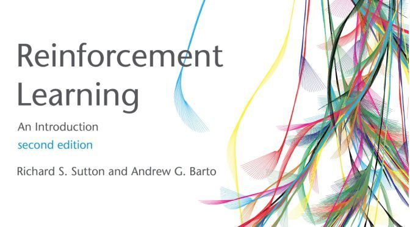

# RL-Algorithms

> If you have any confusion about the code or want to report a bug, please contact me

## reinforcement-learning-an-introduction
 

参考代码：[编程题参考答案](https://github.com/ShangtongZhang/reinforcement-learning-an-introduction)


## Deep Reinforcement Learning
TBD


# Environment
* python 3.8
* numpy
* matplotlib
* [seaborn](https://seaborn.pydata.org/index.html)
* [tqdm](https://pypi.org/project/tqdm/)

# Usage
> All files are self-contained
```commandline
python any_file_you_want.py
```

# Contribution
If you want to contribute some missing examples or fix some bugs, feel free to open an issue or make a pull request. 